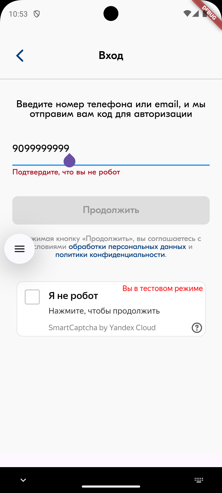

# Yandex SmartCaptcha for Flutter

To learn more about Yandex SmartCaptcha, visit its [official page](https://yandex.cloud/en/services/smartcaptcha).

This package was inspired by [flutter_yandex_smartcaptcha](https://pub.dev/packages/flutter_yandex_smartcaptcha) but offers several improvements, including bug fixes, better performance and a cleaner API.
  

  
  
  

  
  

